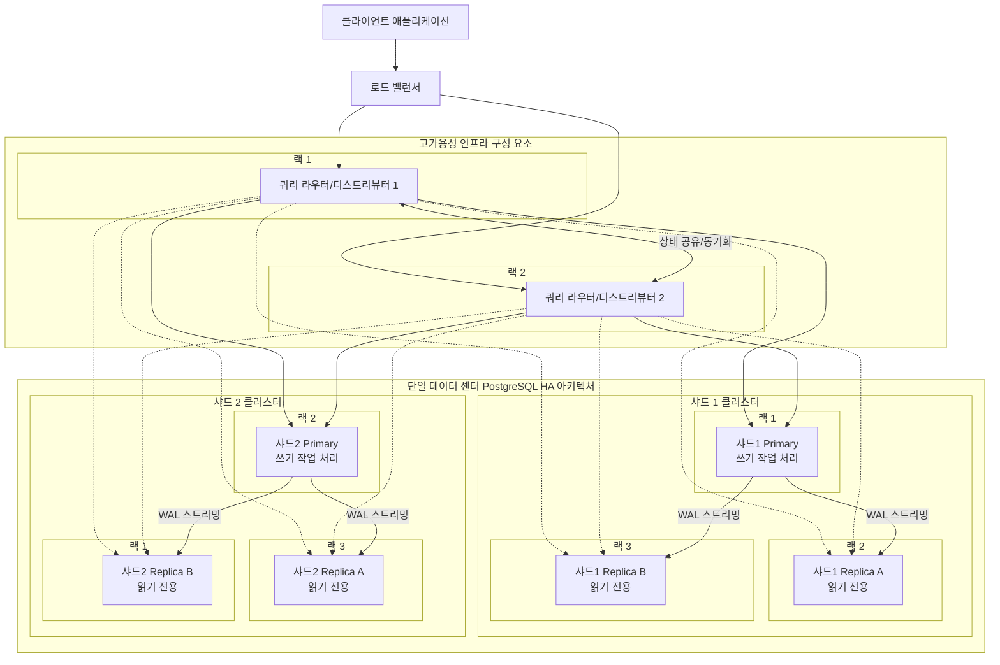
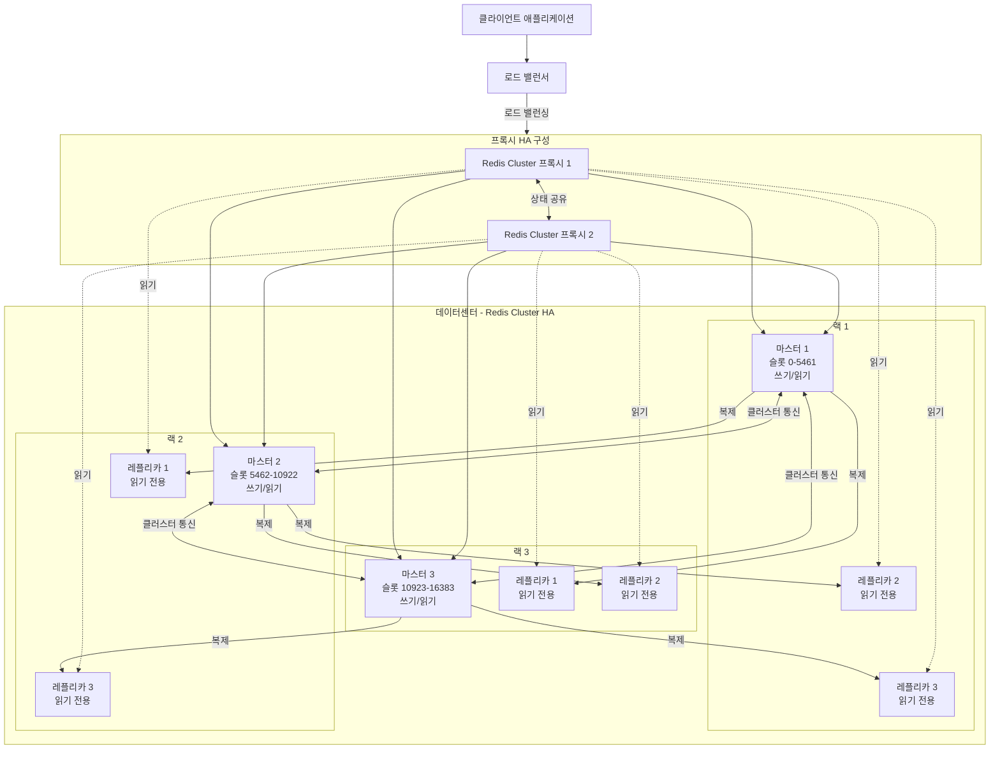
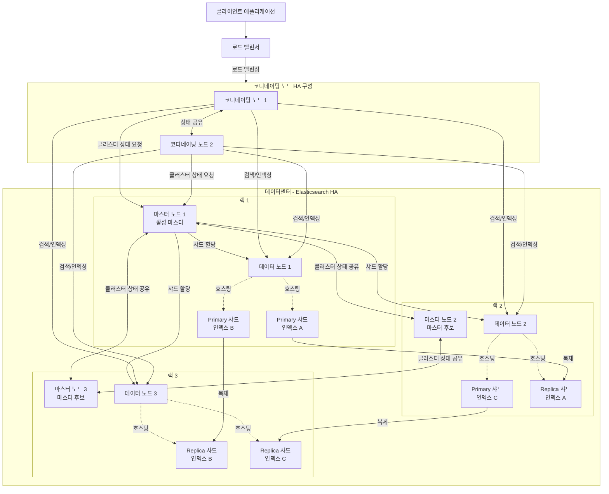
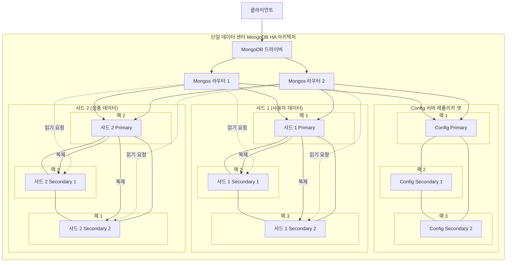

# postgresql

```mermaid
graph TD
    client[클라이언트 애플리케이션] --> lb[로드 밸런서]
    
    lb --> router1[쿼리 라우터/디스트리뷰터 1]
    lb --> router2[쿼리 라우터/디스트리뷰터 2]
    
    router1 <-->|상태 공유/동기화| router2
    
    router1 --> primary1
    router1 --> primary2
    router1 -.-> replica1A
    router1 -.-> replica1B
    router1 -.-> replica2A
    router1 -.-> replica2B
    
    router2 --> primary1
    router2 --> primary2
    router2 -.-> replica1A
    router2 -.-> replica1B
    router2 -.-> replica2A
    router2 -.-> replica2B
    
    subgraph "단일 데이터 센터 PostgreSQL HA 아키텍처"
        subgraph "샤드 1 클러스터"
            subgraph "랙 1"
                primary1[샤드1 Primary<br>쓰기 작업 처리]
            end
            
            subgraph "랙 2"
                replica1A[샤드1 Replica A<br>읽기 전용]
            end
            
            subgraph "랙 3"
                replica1B[샤드1 Replica B<br>읽기 전용]
            end
            
            primary1 -->|WAL 스트리밍| replica1A
            primary1 -->|WAL 스트리밍| replica1B
        end
        
        subgraph "샤드 2 클러스터"
            subgraph "랙 2"
                primary2[샤드2 Primary<br>쓰기 작업 처리]
            end
            
            subgraph "랙 3"
                replica2A[샤드2 Replica A<br>읽기 전용]
            end
            
            subgraph "랙 1"
                replica2B[샤드2 Replica B<br>읽기 전용]
            end
            
            primary2 -->|WAL 스트리밍| replica2A
            primary2 -->|WAL 스트리밍| replica2B
        end
    end
    
    subgraph "고가용성 인프라 구성 요소"
        subgraph "랙 1"
            router1[쿼리 라우터/디스트리뷰터 1]
        end
        
        subgraph "랙 2"
            router2[쿼리 라우터/디스트리뷰터 2]
        end
    end
```

# redis

```mermaid
graph TD
    client[클라이언트 애플리케이션] --> lb[로드 밸런서]
    lb -->|로드 밸런싱| proxy_ha
    
    subgraph proxy_ha[프록시 HA 구성]
        proxy1[Redis Cluster 프록시 1]
        proxy2[Redis Cluster 프록시 2]
        proxy1 <-->|상태 공유| proxy2
    end
    
    subgraph "데이터센터 - Redis Cluster HA"
        subgraph "랙 1"
            master1[마스터 1<br>슬롯 0-5461<br>쓰기/읽기]
            replica2_1[레플리카 2<br>읽기 전용]
            replica3_1[레플리카 3<br>읽기 전용]
        end
        
        subgraph "랙 2"
            master2[마스터 2<br>슬롯 5462-10922<br>쓰기/읽기]
            replica1_2[레플리카 1<br>읽기 전용]
            replica3_2[레플리카 3<br>읽기 전용]
        end
        
        subgraph "랙 3"
            master3[마스터 3<br>슬롯 10923-16383<br>쓰기/읽기]
            replica1_3[레플리카 1<br>읽기 전용]
            replica2_3[레플리카 2<br>읽기 전용]
        end
        
        %% 복제 관계
        master1 -->|복제| replica1_2
        master1 -->|복제| replica1_3
        
        master2 -->|복제| replica2_1
        master2 -->|복제| replica2_3
        
        master3 -->|복제| replica3_1
        master3 -->|복제| replica3_2
        
        %% 클러스터 통신
        master1 <-->|클러스터 통신| master2
        master2 <-->|클러스터 통신| master3
        master3 <-->|클러스터 통신| master1
    end
    
    %% 프록시 연결
    proxy1 --> master1
    proxy1 --> master2
    proxy1 --> master3
    proxy1 -.->|읽기| replica1_2
    proxy1 -.->|읽기| replica2_1
    proxy1 -.->|읽기| replica3_1
    
    proxy2 --> master1
    proxy2 --> master2
    proxy2 --> master3
    proxy2 -.->|읽기| replica1_3
    proxy2 -.->|읽기| replica2_3
    proxy2 -.->|읽기| replica3_2
```

# elasticsearch

```mermaid
graph TD
    client[클라이언트 애플리케이션] --> lb[로드 밸런서]
    lb -->|로드 밸런싱| coord_ha
    
    subgraph coord_ha[코디네이팅 노드 HA 구성]
        coord1[코디네이팅 노드 1]
        coord2[코디네이팅 노드 2]
        coord1 <-->|상태 공유| coord2
    end
    
    subgraph "데이터센터 - Elasticsearch HA"
        subgraph "랙 1"
            master1[마스터 노드 1<br>활성 마스터]
            data1[데이터 노드 1]
            primary1[Primary 샤드<br>인덱스 A]
            primary2[Primary 샤드<br>인덱스 B]
        end
        
        subgraph "랙 2"
            master2[마스터 노드 2<br>마스터 후보]
            data2[데이터 노드 2]
            primary3[Primary 샤드<br>인덱스 C]
            replica1[Replica 샤드<br>인덱스 A]
        end
        
        subgraph "랙 3"
            master3[마스터 노드 3<br>마스터 후보]
            data3[데이터 노드 3]
            replica2[Replica 샤드<br>인덱스 B]
            replica3[Replica 샤드<br>인덱스 C]
        end
        
        %% 마스터 노드 간 통신
        master1 <-->|클러스터 상태 공유| master2
        master2 <-->|클러스터 상태 공유| master3
        master3 <-->|클러스터 상태 공유| master1
        
        %% 데이터 노드에 샤드 배치
        data1 -.->|호스팅| primary1
        data1 -.->|호스팅| primary2
        data2 -.->|호스팅| primary3
        data2 -.->|호스팅| replica1
        data3 -.->|호스팅| replica2
        data3 -.->|호스팅| replica3
        
        %% 샤드 복제 관계
        primary1 -->|복제| replica1
        primary2 -->|복제| replica2
        primary3 -->|복제| replica3
    end
    
    %% 코디네이팅 노드와 마스터 노드 연결
    coord1 -->|클러스터 상태 요청| master1
    coord2 -->|클러스터 상태 요청| master1
    
    %% 마스터 노드와 데이터 노드 연결
    master1 -->|샤드 할당| data1
    master1 -->|샤드 할당| data2
    master1 -->|샤드 할당| data3
    
    %% 코디네이팅 노드와 데이터 노드 연결
    coord1 -->|검색/인덱싱| data1
    coord1 -->|검색/인덱싱| data2
    coord1 -->|검색/인덱싱| data3
    
    coord2 -->|검색/인덱싱| data1
    coord2 -->|검색/인덱싱| data2
    coord2 -->|검색/인덱싱| data3
```

# mongodb

```mermaid
graph TD
    client[클라이언트] --> router[MongoDB 드라이버]
    
    subgraph "단일 데이터 센터 MongoDB HA 아키텍처"
        router --> mongos1[Mongos 라우터 1]
        router --> mongos2[Mongos 라우터 2]
        
        subgraph "Config 서버 레플리카 셋"
            subgraph "랙 1"
                configP[Config Primary]
            end
            
            subgraph "랙 2"
                configS1[Config Secondary 1]
            end
            
            subgraph "랙 3"
                configS2[Config Secondary 2]
            end
            
            configP --- configS1
            configS1 --- configS2
            configS2 --- configP
        end
        
        mongos1 --> configP
        mongos2 --> configP
        
        subgraph "샤드 1 (사용자 데이터)"
            subgraph "랙 1"
                shard1P[샤드 1 Primary]
            end
            
            subgraph "랙 2"
                shard1S1[샤드 1 Secondary 1]
            end
            
            subgraph "랙 3"
                shard1S2[샤드 1 Secondary 2]
            end
            
            shard1P --- shard1S1
            shard1S1 --- shard1S2
            shard1S2 --- shard1P
            
            shard1P -->|복제| shard1S1
            shard1P -->|복제| shard1S2
        end
        
        subgraph "샤드 2 (상품 데이터)"
            subgraph "랙 2"
                shard2P[샤드 2 Primary]
            end
            
            subgraph "랙 3"
                shard2S1[샤드 2 Secondary 1]
            end
            
            subgraph "랙 1"
                shard2S2[샤드 2 Secondary 2]
            end
            
            shard2P --- shard2S1
            shard2S1 --- shard2S2
            shard2S2 --- shard2P
            
            shard2P -->|복제| shard2S1
            shard2P -->|복제| shard2S2
        end
        
        mongos1 --> shard1P
        mongos1 --> shard2P
        mongos2 --> shard1P
        mongos2 --> shard2P
        
        mongos1 -.->|읽기 요청| shard1S1
        mongos1 -.->|읽기 요청| shard2S1
        mongos2 -.->|읽기 요청| shard1S2
        mongos2 -.->|읽기 요청| shard2S2
    end
```
