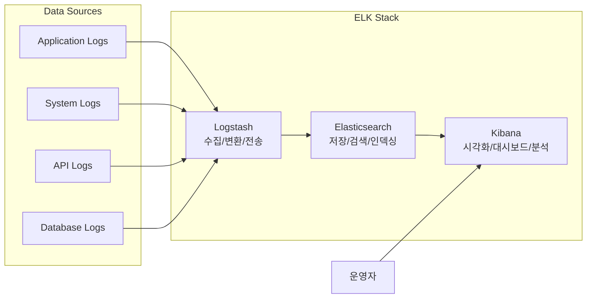
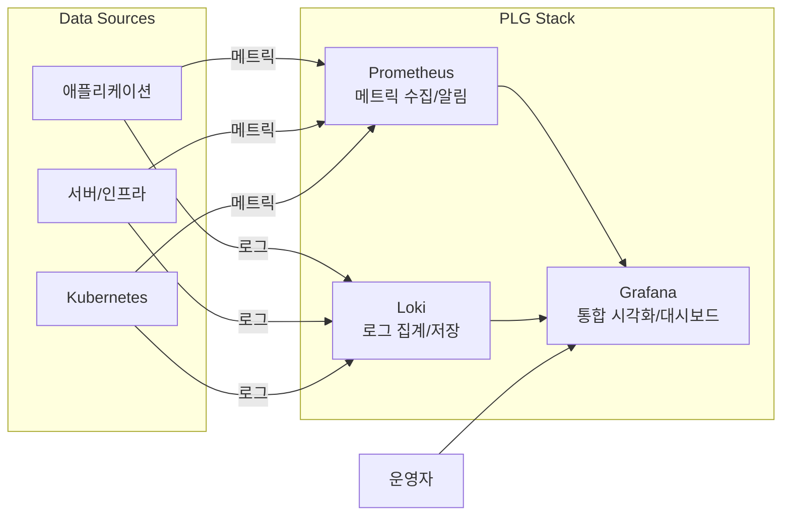

# ELK Stack  
  - **solution**  
    - Elasticsearch: 분산형 검색 및 분석 엔진으로 로그 데이터를 저장하고 검색  
    - Logstash: 다양한 소스에서 데이터를 수집, 변환 및 전송하는 데이터 파이프라인  
    - Kibana: Elasticsearch 데이터를 시각화하고 탐색하기 위한 대시보드 제공  
  - **pros**  
    - 강력한 전문 검색(full-text search) 기능으로 로그 데이터에서 신속하게 정보 검색 가능  
    - 다양한 데이터 소스와 포맷을 지원하는 유연한 구조  
    - 시각화 및 대시보드 기능이 뛰어나 데이터 분석이 용이함  
  - **cons**  
    - 대규모 환경에서 리소스 소비가 많고 운영 비용이 높을 수 있음  
    - 초기 설정 및 구성이 복잡하고 러닝 커브가 가파름  
    - 대규모 데이터 처리 시 성능 튜닝이 필요할 수 있음

# PLG Stack  
  - **solution**  
    - Prometheus: 메트릭 기반 모니터링 시스템으로 시계열 데이터 수집 및 알림 기능 제공  
    - Loki: 로그 집계 시스템으로 Prometheus에서 영감을 받아 설계된 경량 로그 관리 솔루션  
    - Grafana: 다양한 데이터 소스에서 수집된 메트릭과 로그를 시각화하는 플랫폼  
  - **pros**  
    - Kubernetes 환경과의 통합이 우수하고 클라우드 네이티브 환경에 최적화  
    - Prometheus의 강력한 쿼리 언어(PromQL)를 통한 메트릭 분석 용이  
    - Loki는 로그 인덱싱을 최소화하여 저장 공간과 비용 효율성 높음  
    - Grafana의 통합 대시보드를 통해 메트릭과 로그를 함께 볼 수 있어 문제 해결 속도 향상  
  - **cons**  
    - Elasticsearch에 비해 Loki의 로그 검색 기능이 제한적일 수 있음  
    - 장기 데이터 저장 및 관리에 추가 솔루션이 필요할 수 있음  
    - 복잡한 알림 규칙 설정 및 관리에 전문 지식이 필요함

