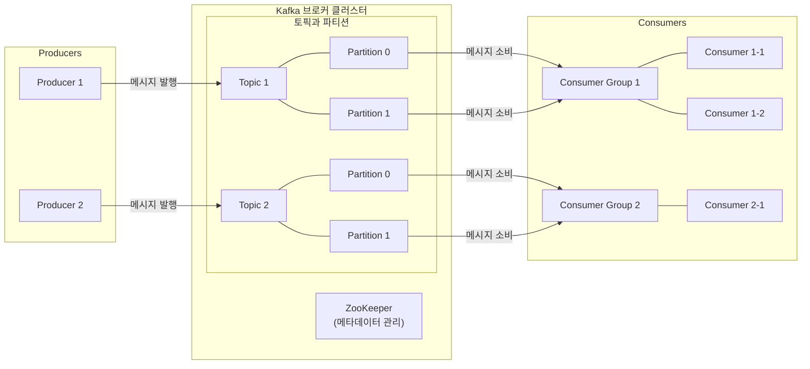
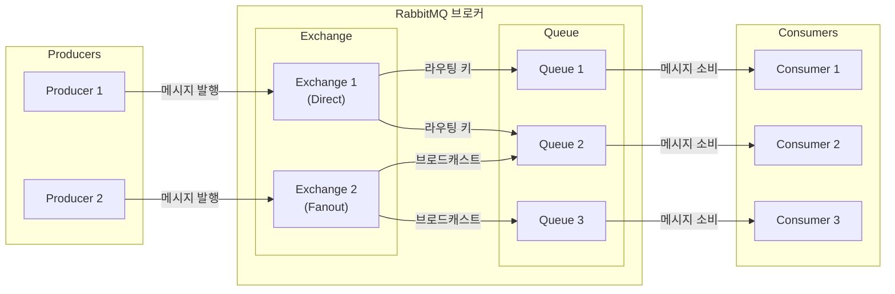
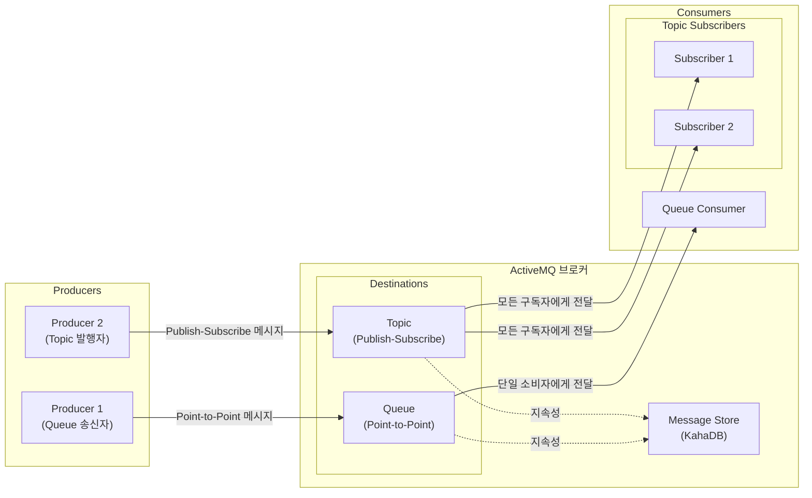
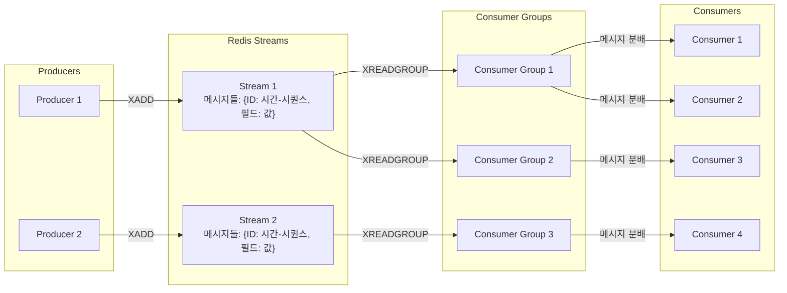

# Apache Kafka
- **challenge**  
  - 높은 처리량, 내구성, 확장성을 갖춘 발행-구독(pub-sub) 메시징 시스템으로 설계됨
- **pros**  
  - 극도로 높은 처리량 (초당 수백만 개의 메시지)
  - 확장성이 뛰어나며 분산 시스템으로 설계됨
  - 메시지 영속성과 내구성 (디스크에 데이터 보존)
  - 스트림 처리 기능 (Kafka Streams, KSQL)
  - 장기간 데이터 보존 가능 (시간 또는 용량 기반)
- **cons**  
  - 설정과 관리가 복잡함
  - 소규모 응용 프로그램에는 과도한 솔루션일 수 있음
  - 많은 기본 기능에 추가 구성이 필요함
  - 무거운 리소스 소비 (JVM 기반)

# RabbitMQ
- **challenge**  
  - AMQP(Advanced Message Queuing Protocol)를 구현한 오픈 소스 메시지 브로커
- **pros**  
  - 유연한 라우팅 패턴 (Direct, Topic, Fanout, Headers)
  - 높은 신뢰성과 메시지 전달 보장
  - 클러스터링 및 고가용성 기능
  - 관리 UI가 내장되어 있어 운영 편의성 높음
  - 다양한 프로그래밍 언어를 위한 클라이언트 라이브러리 제공
- **cons**  
  - Kafka보다 낮은 처리량
  - 대용량 메시지 처리시 성능 저하 가능성
  - 기본적으로 디스크에 영구 저장하여 I/O 병목 발생 가능
  - 복잡한 설정이 필요한 경우 학습 곡선 존재

# Apache ActiveMQ
- **challenge**  
  - JMS(Java Message Service) API를 구현한 오픈 소스 메시지 브로커
- **pros**  
  - JMS 표준 완벽 지원 (Java 기반 애플리케이션과 호환성 높음)
  - 다양한 통신 프로토콜 지원
  - 트랜잭션 처리 지원
  - 영구 메시지 저장소 제공
  - 클러스터링과 마스터-슬레이브 복제 지원
- **cons**  
  - Kafka나 RabbitMQ보다 낮은 성능
  - 큰 부하에서 안정성 이슈 발생 가능
  - 설정 및 관리가 복잡할 수 있음
  - 최신 버전의 ActiveMQ Artemis로 이전하는 추세

# Redis Streams
- **challenge**  
  - Redis 5.0에서 도입된 데이터 구조로, 로그 또는 시계열 데이터를 위해 스트리밍 기능을 제공
- **pros**  
  - 높은 성능과 낮은 지연 시간 (메모리 내 작동)
  - 간단한 설정 (Redis를 이미 사용하는 경우 추가 인프라 불필요)
  - 소비자 그룹을 통한 메시지 분배 기능
  - 메시지 ID를 통한 임의 접근 용이성
  - 경량 솔루션 (소규모 응용 프로그램에 적합)
- **cons**  
  - 기본적으로 메모리에 제한됨 (RDB/AOF로 지속성 확보 가능)
  - Kafka나 RabbitMQ에 비해 고급 라우팅 기능 부족
  - 대규모 분산 시스템에서의 확장성 제한
  - 비동기식 복제로 인한 잠재적 데이터 손실 위험

