# Spring
## IoC (Inversion of Control) & Spring Bean
- **challenge**
  - 기존 개발 방식에서는 개발자가 객체의 생성, 생명주기, 관리 등 모든 제어권을 직접 가짐
  - new 키워드로 객체를 직접 생성하면 객체 간 강한 결합도가 발생하여 유연성과 재사용성이 저하됨
  - 여러 클라이언트가 접근할 때마다 객체를 생성하면 메모리 낭비와 성능 저하 발생
- **option**
  - Spring Container가 IoC를 담당하여 객체의 생성과 생명주기를 관리함
  - Spring에서 관리하는 자바 객체를 Bean이라 하며, 스프링 컨테이너에 등록하여 사용
  - DI(의존성 주입)를 통해 객체 간의 관계를 설정하여 낮은 결합도와 높은 유연성 확보
  - Component Scan(@Component, @Service, @Repository, @Controller) 또는 Java 코드(@Configuration, @Bean)로 빈을 등록
  - 싱글톤 스코프를 기본으로 하여 하나의 인스턴스만 생성하고 공유함으로써 메모리 효율성 향상
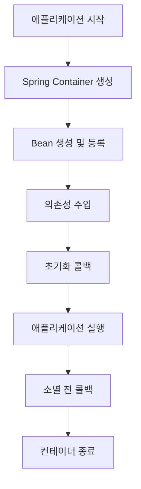
## AOP (Aspect-Oriented Programming)
- **challenge**
  - 로깅, 트랜잭션 관리, 보안 등의 공통 기능이 여러 모듈에 중복 구현되는 문제 발생
  - 핵심 비즈니스 로직과 부가 기능이 혼재되어 코드 가독성과 유지보수성 저하
  - 공통 기능 변경 시 여러 모듈을 수정해야 하는 번거로움 존재
- **option**
  - Aspect: 공통 관심사를 모듈화한 단위로 여러 객체에 적용되는 기능을 분리
  - Advice: 메서드 실행 전(Before), 후(After), 전후(Around) 등 적용 시점을 지정
  - Pointcut: 어떤 메서드에 어떤 Advice를 적용할지 결정하는 표현식
  - Join Point: Advice가 적용될 수 있는 메서드 호출, 메서드 실행 시점 등의 특정 시점
  - Weaving: Aspect를 대상 코드에 적용하는 프로세스
  - 선언적 방식으로 비즈니스 로직과 공통 기능을 분리하여 코드의 재사용성, 유지보수성 향상
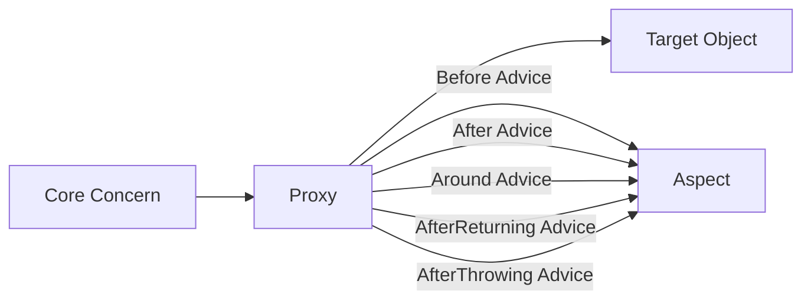
## Spring MVC
- **challenge**
  - 웹 애플리케이션 개발 시 비즈니스 로직과 UI 처리 코드가 혼재되어 유지보수 어려움
  - HTTP 요청 처리, 파라미터 변환, 응답 생성 등의 반복적인 코드 작성 필요
  - 다양한 클라이언트(웹, 모바일, API)에 대응하기 위한 유연한, 구조화된 설계 필요
- **option**
  - Model-View-Controller 패턴을 기반으로 애플리케이션의 비즈니스 로직과 UI를 분리
  - DispatcherServlet이 중앙 컨트롤러 역할을 하며 요청을 적절한 핸들러로 라우팅
  - @Controller 어노테이션을 사용하여 컨트롤러 클래스 정의 및 요청 매핑 설정
  - Model 객체를 통해 데이터를 View에 전달하여 화면 렌더링
  - ViewResolver를 통해 논리적 뷰 이름을 실제 View 구현체로 변환
  - @RequestMapping, @GetMapping, @PostMapping 등으로 HTTP 메서드와 URL 매핑 관리
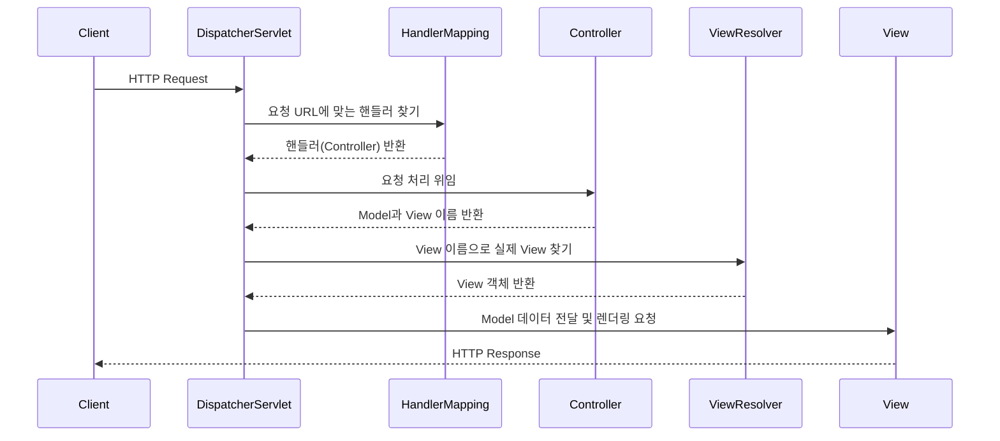
## Spring Security
- **challenge**
  - 웹 애플리케이션의 인증(Authentication)과 권한 부여(Authorization) 구현 복잡성
  - CSRF, XSS 등 다양한 보안 취약점에 대한 방어 메커니즘 필요
  - 세션 관리, 암호화, OAuth 통합 등 보안 관련 기능 직접 구현 시 오류 발생 가능성 높음
- **option**
  - 인증(Authentication): 사용자의 신원을 확인하는 과정 제공
  - 권한 부여(Authorization): 인증된 사용자에게 특정 리소스 접근 권한 관리
  - SecurityFilterChain을 통한 보안 필터 설정 및 요청 보안 처리
  - CSRF 보호, 세션 관리, 로그인/로그아웃 기능 기본 제공
  - OAuth2, JWT 등 다양한 인증 방식 지원
  - Servlet Filter Chain 개념을 활용하여 HTTP 요청 처리 전 보안 검사 수행
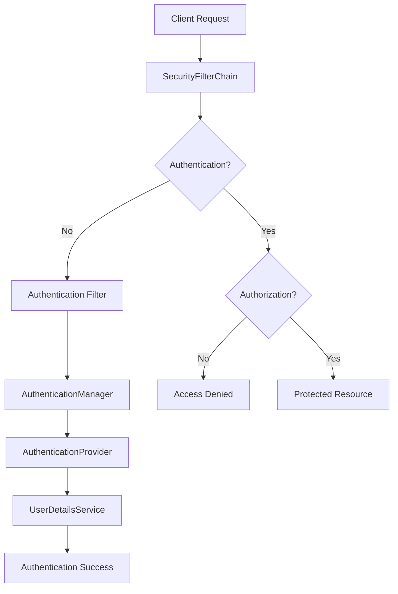
## Test
- **challenge**
  - 코드 변경 시 기존 기능이 정상 동작하는지 수동 확인의 비효율성
  - 테스트 코드 없이 리팩토링 시 기능 정상 동작 여부 판단 어려움
  - 복잡한 의존성을 가진 코드의 테스트 구현 난이도 높음
  - 테스트 환경 구성 및 데이터 준비의 번거로움
- **option**
  - Unit Test(단위 테스트): 애플리케이션의 개별 기능/메서드 단위로 독립적 테스트
  - Integration Test(통합 테스트): 모듈 간 상호작용 및 통합 기능 검증
  - @SpringBootTest: 전체 애플리케이션 컨텍스트를 로드하여 통합 테스트 수행
  - @WebMvcTest: 컨트롤러 계층만 테스트하며 빠른 테스트 수행 가능
  - @DataJpaTest: JPA 관련 컴포넌트만 테스트
  - Mockito를 활용한 의존성 모킹으로 격리된 환경에서 테스트 수행
## Web Server & Web Aplication Server & API Server
- **challenge**
  - 정적 콘텐츠와 동적 콘텐츠 제공을 위한 서버 구성의 복잡성
  - 사용자별 맞춤형 동적 데이터 생성 및 제공의 어려움
  - 높은 트래픽 처리와 확장성 확보를 위한 서버 아키텍처 설계 필요
  - 다양한 클라이언트와의 효율적인 데이터 교환 방식 구현 필요
- **option**
  - Web Server: HTTP 프로토콜을 기반으로 정적 컨텐츠(HTML, CSS, JS 파일 등)를 제공(Apache, Nginx)
  - Web Application Server(WAS): 웹 서버와 웹 컨테이너를 합친 개념으로 동적 데이터 생성 및 비즈니스 로직 처리
  - Web Container: 서블릿 관리 및 요청-응답 객체 생성, 생명주기 관리 담당
  - API Server: 클라이언트와 서버 간 데이터 교환을 위한 인터페이스 제공, 주로 JSON/XML 형식 사용
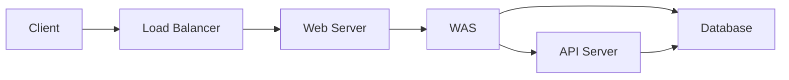
## Data Acess & ORM
- **challenge**
  - 객체 지향 언어(Java)와 관계형 데이터베이스 간의 패러다임 불일치
  - SQL 쿼리 작성의 번거로움과 유지보수 어려움
  - JDBC를 직접 사용할 때 발생하는 많은 반복 코드(connection 관리, 예외 처리 등)
  - DB 변경 시 애플리케이션 코드 수정 필요성
- **option**
  - ORM(Object-Relational Mapping): 객체와 DB 테이블 간 매핑을 통해 객체 조작으로 DB 제어
  - JPA(Java Persistence API): 자바 ORM 기술 표준으로 객체-관계형 데이터베이스 매핑 제공
  - Hibernate: JPA 구현체로 객체-테이블 매핑 및 SQL 생성 자동화
  - Spring Data JPA: JPA 기반 데이터 액세스 계층 구현 간소화 및 반복 코드 제거
  - Repository 인터페이스 정의만으로 CRUD 연산 구현 및 사용 가능
  - @Entity, @Table, @Column 등의 어노테이션으로 객체-테이블 매핑 설정
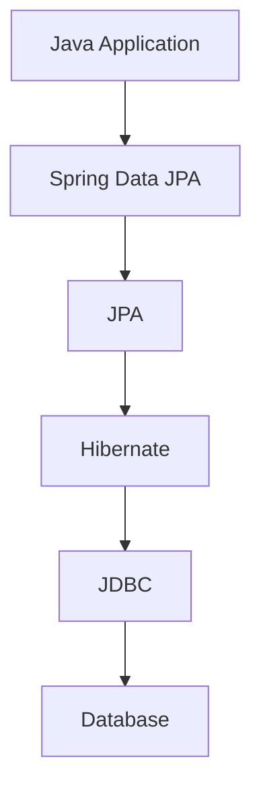
## Spring Webflux
- **challenge**
  - 전통적인 Spring MVC의 Thread-per-request 모델에서 높은 트래픽 처리 시 스레드 부족 문제 발생
  - 다수의 동시 요청 처리 시 컨텍스트 스위칭 비용 증가로 성능 저하
  - 블로킹 I/O 방식에서 스레드가 I/O 작업 대기 시간 동안 유휴 상태로 자원 낭비
  - 마이크로서비스 아키텍처에서 서비스 간 호출이 많을 때 병목현상 발생
- **option**
  - 비동기/논블로킹 리액티브 프로그래밍 모델 채택으로 적은 스레드로 많은 요청 처리
  - Event Loop 모델을 사용하여 요청 처리 중 I/O 대기 시간에 다른 요청 처리 가능
  - Project Reactor 라이브러리 기반으로 Mono(단일 데이터)와 Flux(스트림 데이터) 타입 제공
  - Netty 서버 기반으로 동작하며 서블릿 API를 사용하지 않음
  - 고성능 웹 애플리케이션 개발 및 마이크로서비스 아키텍처에 적합
  - 주의: 모든 의존성(DB, 외부 API 등)이 논블로킹으로 구현되어야 성능 이점 극대화
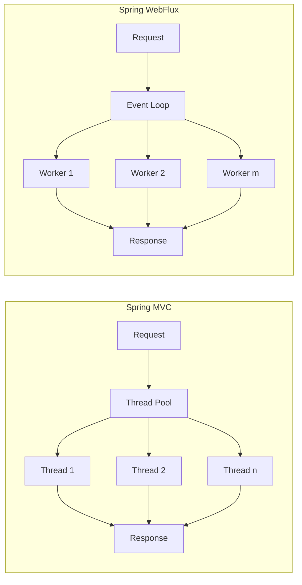
# JVM
## JVM Structure & Components
- **challenge**
  - 플랫폼 독립적인 바이트코드 실행을 위한 가상 머신 아키텍처 설계 필요
  - 메모리 관리, 클래스 로딩, 실행 엔진 등 다양한 구성 요소 간 협업 메커니즘 구현 복잡성
- **option**
  - Class Loader: 클래스 파일을 로드하고 링크/초기화하는 서브시스템
  - Runtime Data Areas
    - Heap: 객체/배열 저장
    - Method Area: 클래스 메타데이터 저장
    - Stack: 스레드별 메서드 호출 정보 저장
    - PC Register: 스레드별 실행 중인 명령어 주소 저장
  - Execution Engine
    - Interpreter: 바이트코드 해석 실행
    - JIT Compiler: 핫스팟 코드를 네이티브 코드로 컴파일
    - Garbage Collector: 메모리 자동 관리
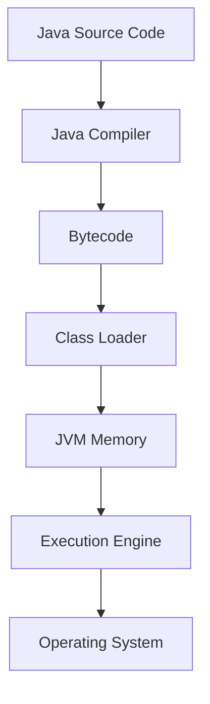
## JVM Memory
- **challenge**
  - 제한된 물리적 메모리 내에서 효율적인 객체 할당/관리 필요
  - 메모리 누수 방지 및 안정적인 애플리케이션 실행 보장
- **option**
  - Young Generation
    - Eden: 새 객체 할당 영역
    - Survivor 0/1: Minor GC 생존 객체 임시 저장
  - Old Generation: 장기 생존 객체 저장
  - Metaspace(Java 8+): 클래스 메타데이터 저장(Native 메모리 사용)
  - Stack Memory: 스레드별 메서드 호출 프레임 저장
  - Direct Memory: NIO에서 사용되는 네이티브 메모리 영역
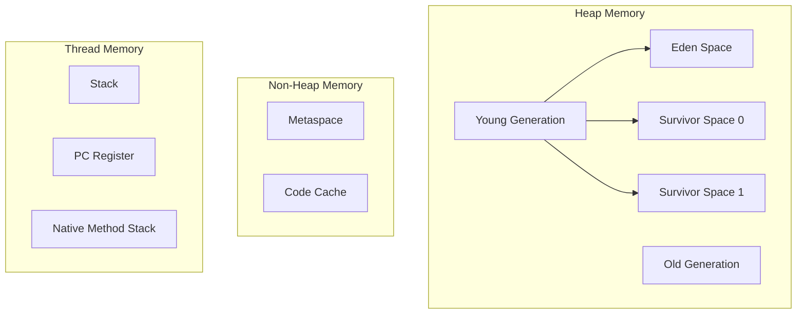
## JVM JIT (Just-In-Time) Compiler
- **challenge**
  - 인터프리터 방식의 성능 한계 극복 필요
  - 자주 실행되는 코드(Hotspot)의 효율적 최적화 요구
- **option**
  - Tiered Compilation
    - Level 0: 인터프리터 모드
    - Level 1-3: C1 컴파일러 사용(최적화 수준 점진적 증가)
    - Level 4: C2 컴파일러 사용(고도 최적화)
  - Code Cache: JIT 컴파일 결과물 저장 영역
  - Method Inlining: 빈번히 호출되는 메서드 내부 코드 병합
  - Loop Optimization: 반복문 최적화 기법 적용
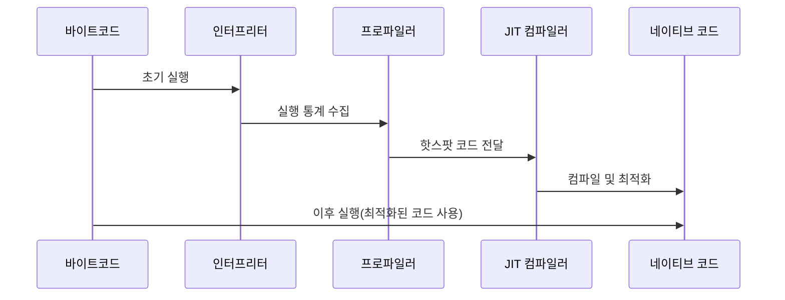
## JVM Thread
- **challenge**
  - 다중 스레드 환경에서 동시성 제어 및 자원 경쟁 관리
  - 컨텍스트 스위칭 오버헤드 최소화 필요
- **option**
  - Platform Thread: OS 스레드와 1:1 매핑되는 전통적 스레드 모델
  - Virtual Thread(Java 19+): 경량 스레드로 수백만 개 동시 생성 가능
  - ForkJoinPool: 작업 병렬 처리용 스레드 풀
  - Carrier Thread: 가상 스레드 실행을 담당하는 실제 스레드
  - Thread Scheduler: 스레드 실행 순서 및 자원 할당 관리
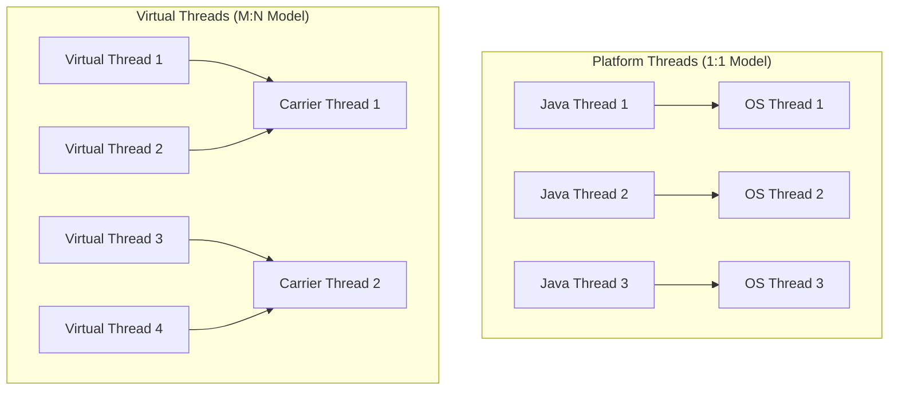
## JVM Garbage Collection
- **challenge**  
  - JVM을 사용하는 프로젝트의 별도 설정을 해주지 않으면 사용하는 컴퓨팅 자원의 사이즈에 따라 GC 알고리즘이 채택  
  - Production 환경에서 관리자가 의도치 않게 어플리케이션이 원시적인 GC 알고리즘을 사용할 수 있음
- **option**  
  - G1 GC
    - 하드웨어가 발전함에 따라 큰 메모리(RAM) 공간을 가지고 있는 멀티 프로세서 시스템에서 빠른 처리 속도를 지원한다.
    - 최소 2 cpu 및 4GB memory 인 환경에서 권장되며 Java 9+부터는 default GC로 채택
    - GC 동안 애플리케이션의 작업이 예측 가능한 짧은 시간동안 멈춤
  - Serial GC
    - 가장 간단한 GC 구현체이며 싱글 스레드로 동작
    - GC가 실행되는 동안 애플리케이션의 모든 작업이 멈춤
  - Parallel GC / CMS GC
    - 다수의 스레드를 사용하며, GC 동작 시 최소한의 pause 타임을 가지도록 설계
    - GC 동안 애플리케이션의 작업이 멈추지만, 멀티 스레드로 인해 처리 속도가 빠름
  - Z GC
    - Java11부터 실험적으로 소개되어 Java15에 릴리즈된 확장성 있는 GC
    - GC 동안 애플리케이션의 작업이 멈추는 시간을 10ms 아래로 가져가는 것을 목표
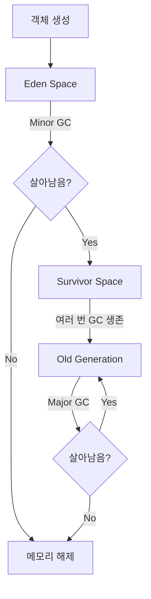
