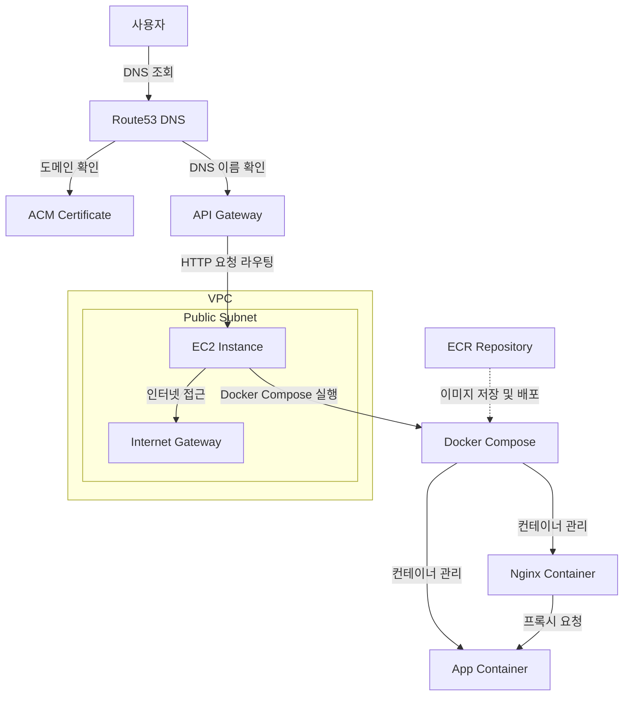

# 스케치 컬러화 애플리케이션 인프라 구조 ([테스트 링크](https://www.junhyung.xyz))
이 프로젝트는 스케치 이미지를 컬러화하는 웹 애플리케이션을 AWS 인프라에 배포한 구조를 보여줍니다. <br>
Terraform으로 구성된 인프라와 Docker 컨테이너로 배포된 애플리케이션을 포함합니다.

## 인프라 구조 개요


## 인프라 구성 요소

### 1. Amazon Route53
- 도메인 이름: **junhyung.xyz**
- 서브도메인: **www.junhyung.xyz**
- Route53 DNS 레코드가 API Gateway로 트래픽을 라우팅합니다.

### 2. AWS Certificate Manager (ACM)
- 도메인 및 서브도메인을 위한 SSL/TLS 인증서 제공
- DNS 검증 방식으로 인증서 확인

### 3. Amazon API Gateway
- HTTP API 유형으로 구성
- EC2 인스턴스에 트래픽을 프록시 형태로 라우팅
- 커스텀 도메인 연결 (junhyung.xyz, www.junhyung.xyz)

### 4. Amazon VPC
- CIDR: **10.0.0.0/16**
- 가용 영역: **ap-northeast-2a, ap-northeast-2b, ap-northeast-2c, ap-northeast-2d**
- 퍼블릭 서브넷: **10.0.101.0/24, 10.0.102.0/24, 10.0.103.0/24, 10.0.104.0/24**
- 프라이빗 서브넷: **10.0.1.0/24, 10.0.2.0/24, 10.0.3.0/24, 10.0.4.0/24**

### 5. Amazon EC2
- 인스턴스 유형: **t2.micro**
- Amazon Linux 2023 AMI
- 퍼블릭 서브넷에 배치
- Elastic IP 할당
- 보안 그룹: SSH(22), HTTP(80), HTTPS(443) 트래픽 허용

### 6. Amazon ECR
- 리포지토리 이름: **app-repository**
- 이미지 수명주기 정책: 최대 3개 이미지 유지

### 7. Docker Compose 구성

```yaml
services:
  nginx:
    image: 021891580251.dkr.ecr.ap-northeast-2.amazonaws.com/app-repository:nginx
    ports:
      - "80:80"
    depends_on:
      - app
    restart: always

  app:
    image: 021891580251.dkr.ecr.ap-northeast-2.amazonaws.com/app-repository:app
    restart: always
    environment:
      - PORT=7860
```
