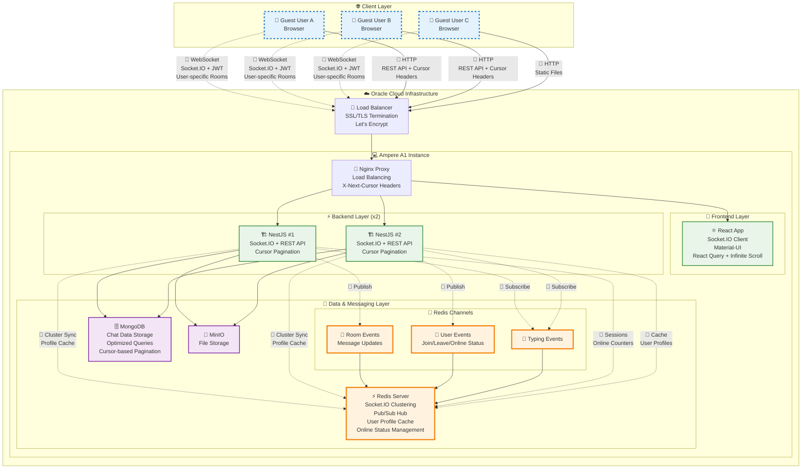

# 실시간 채팅 서비스 ([테스트 링크](https://www.junhyung.xyz))
이 프로젝트는 NestJS와 React를 사용한 실시간 채팅 애플리케이션을 Oracle Cloud(OCI) 무료 티어에 최저비용으로 배포한 구조를 보여줍니다. <br>
Socket.IO를 활용한 실시간 통신과 JWT 기반 게스트 인증 시스템을 구현했습니다. <br>
Terraform으로 구성된 인프라와 Docker Compose로 배포된 마이크로서비스 아키텍처를 포함합니다.

## 애플리케이션 기능
- 실시간 채팅 및 메시지 교환
- 게스트 전용 JWT 인증 시스템
- 채팅방 생성 및 참여
- 사용자 온라인 상태 표시
- 타이핑 인디케이터
- 파일 업로드 및 공유
- 무한 스크롤을 통한 메시지 히스토리
- 반응형 Material-UI 디자인

## 기술 스택
- 백엔드: NestJS, Socket.IO, JWT, MongoDB, Redis
- 프론트엔드: React 18, Material-UI, Socket.IO Client, React Query
- 데이터베이스: MongoDB 7.0 (채팅 데이터), Redis 7.2 (캐시, 세션)
- 파일 스토리지: MinIO
- 리버스 프록시: Nginx
- 컨테이너화: Docker Compose
- 인프라: Terraform, OCI

## 인프라 비용 (OCI 무료 티어)
- 도메인 비용 (외부)
- OCI 계정 (무료 티어)
- Ampere A1 Flex 인스턴스: 무료 (4 vCPU, 24GB RAM)
- 블록 볼륨: 무료 (~200GB)
- 로드 밸런서: 무료 (Flexible 10 Mbps)
- VCN 및 네트워킹: 무료
- Let's Encrypt SSL: 무료

## 인프라 구조 개요


## 인프라 구성 요소

### 1. Oracle Cloud Infrastructure (OCI)
- 리전: **ap-chuncheon-1** (춘천)
- 가용 도메인: 단일 AD 배포
- 무료 티어 리소스 최대 활용

### 2. OCI Load Balancer
- 타입: **Flexible Load Balancer**
- 대역폭: **10 Mbps** (무료 티어 한도)
- SSL/TLS 종료 처리
- Let's Encrypt 자동 갱신 인증서
- HTTP에서 HTTPS 자동 리디렉션
- 헬스 체크: HTTP `/health` 엔드포인트

### 3. Virtual Cloud Network (VCN)
- CIDR: **10.0.0.0/16**
- 퍼블릭 서브넷: **10.0.1.0/24**
- 인터넷 게이트웨이 및 라우팅 테이블 구성
- 네트워크 보안 그룹으로 트래픽 제어

### 4. Ampere A1 Flex Compute Instance
- 인스턴스 타입: **VM.Standard.A1.Flex**
- vCPU: **4개** (ARM 기반)
- 메모리: **24GB RAM**
- 운영체제: **Ubuntu 24.04 LTS**
- 블록 볼륨: **50GB** (부트) + **100GB** (데이터)
- 엘라스틱 IP 할당

### 5. Docker Compose 서비스 구성
```yaml
services:
  mongodb:     # 1.0 CPU, 6GB RAM (limit)
  redis:       # 0.5 CPU, 3GB RAM (limit)
  backend:     # 0.75 CPU, 3GB RAM (limit)
  frontend:    # 0.5 CPU, 1GB RAM (limit)
  nginx:       # 0.5 CPU, 1GB RAM (limit)
  minio:       # 0.5 CPU, 2GB RAM (limit)
```

### 6. 네트워크 보안 구성
- **로드 밸런서 보안 그룹**: HTTP(80), HTTPS(443) 허용
- **컴퓨트 인스턴스 보안 그룹**: SSH(22), HTTP(80), HTTPS(443) 허용
- **내부 네트워크**: Docker 브리지 네트워크 (172.20.0.0/16)

### 7. Let's Encrypt 자동화
- Cloud-init을 통한 초기 인증서 생성
- Cron 작업으로 주간 자동 갱신
- 로드 밸런서 인증서 업데이트 스크립트

### 8. 모니터링 및 헬스 체크
- 모든 서비스에 헬스 체크 구성
- Docker 컨테이너 자동 재시작 정책
- Nginx 액세스 로그 및 에러 로그
- 애플리케이션 헬스 엔드포인트 (`/health`)

## 개발 및 배포 워크플로우

### 1. 로컬 개발
```bash
# 백엔드 개발
cd app/
npm run start:dev

# 프론트엔드 개발
cd frontend/
npm start

# Docker Compose 개발 환경
docker-compose up -d
```

### 2. 인프라 배포
```bash
cd infra/
terraform init
terraform plan
terraform apply
```

### 3. 프로덕션 배포
```bash
# 서버에서 프로덕션 환경 실행
docker-compose -f docker-compose.prod.yml up -d

# SSL 인증서 업데이트
./scripts/update-letsencrypt-cert.sh
```

## 주요 아키텍처 특징

### 1. 게스트 전용 인증 시스템
- 모든 사용자 ID가 `guest_` 접두사로 시작
- JWT 토큰 기반 WebSocket 인증
- 전통적인 회원가입/로그인 시스템 없음

### 2. 실시간 통신 아키텍처
- Socket.IO 게이트웨이로 WebSocket 이벤트 처리
- Redis를 통한 pub/sub 메시징
- MongoDB 기반 영구 데이터 저장
- 연결된 소켓 매핑을 통한 온라인 사용자 관리

### 3. 확장 가능한 컨테이너 구조
- 각 서비스별 리소스 제한 및 예약
- Docker 헬스 체크 및 자동 재시작
- 프로덕션 환경 최적화 설정

### 4. 비용 최적화 전략
- OCI 무료 티어 리소스 최대 활용
- ARM 기반 Ampere A1 인스턴스 사용
- 단일 인스턴스 마이크로서비스 배포
- Let's Encrypt 무료 SSL 인증서
