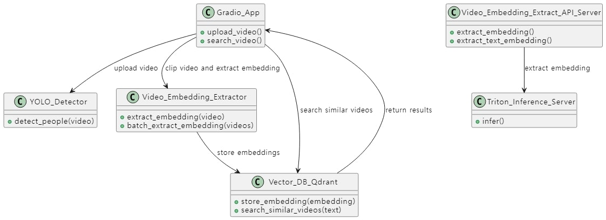

# Semantic Video Search PoC
##### Embedding based Video Text Search

### Models

- InternVideo2 : https://github.com/OpenGVLab/InternVideo/tree/main/InternVideo2 
  - Weight : https://huggingface.co/OpenGVLab/InternVideo2-Stage2_1B-224p-f4/blob/main/InternVideo2-stage2_1b-224p-f4.pt
- YOLO-v8 : https://github.com/ultralytics/ultralytics  

### Application

- Upload Gradio App
    - 비디오를 업로드 하면, YOLO Detector를 사용해서 사람을 탐지하고, 사람이 있는 구간에 대해서 Clip을 만들어서 Video Embedding을 추출하여 Vector DB에 저장

- Search Gradio App
    - Vector DB에 Text Search를 기준으로 가장 유사한 Video 찾아서 보여주기

- Video Embedding Batch Extractor
    - 이미 존재하는 Video 여러개를 한번에 Embedding을 추출하여서 Vector DB 저장

- Video Embedding Extract API Server
    - Triton Inference Server를 사용해서 Video Embedding/Text Embedding을 추출하는 API 서버

### Infra

- Vector DB : Qdrant (https://github.com/qdrant/qdrant)

- GUI App : Gradio

- Inference Server : Triton (https://github.com/triton-inference-server/server)

- Diagram (created by GPT)

