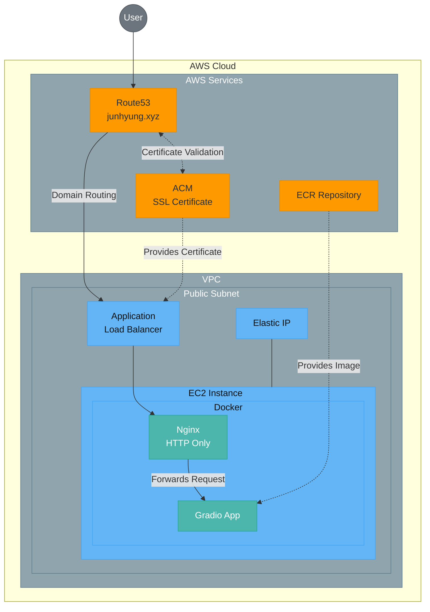

# 객체 인식 애플리케이션 ([테스트 링크](https://www.junhyung.xyz))
이 프로젝트는 이미지에서 객체를 인식하는 Gradio 애플리케이션을 AWS 인프라에 최저비용으로 배포한 구조를 보여줍니다. <br>
[YOLOv5m 모델](https://huggingface.co/Ultralytics/YOLOv5)과 ONNX Runtime을 사용하여 CPU 기반 객체 감지를 구현했습니다. <br>
Terraform으로 구성된 인프라와 Docker 컨테이너로 배포된 애플리케이션을 포함합니다.

## 애플리케이션 기능
- Gradio 웹 인터페이스
- YOLOv5m 모델을 사용한 객체 감지
- ONNX Runtime을 통한 CPU 기반 추론
- 80개 COCO 클래스 객체 감지 지원

## 기술 스택
- 객체 감지: YOLOv5m (ONNX 버전)
- 웹 인터페이스: Gradio
- 이미지 처리: OpenCV, NumPy
- 추론 엔진: ONNX Runtime
- 배포: Docker, AWS

## 인프라 비용
- 도메인 비용
- AWS free tier 계정
- AWS Route53 호스팅 영역: 0.5$ per month
- AWS ALB: 0$ (~ 15 LCU)
- AWS EC2: 0$ (t2.micro)
- AWS EBS: 0$ (~ 30 GB)
- AWS ECR: 0$ (~ 500 MB)
- AWS IAM: 0$

## 인프라 구조 개요


## 인프라 구성 요소

### 1. Amazon Route53
- 도메인 이름: **junhyung.xyz**
- 서브도메인: **www.junhyung.xyz**
- Route53 DNS 레코드가 EC2로 트래픽을 라우팅합니다.

### 2. AWS Certificate Manager (ACM)
- 도메인 및 서브도메인을 위한 SSL/TLS 인증서 제공
- DNS 검증 방식으로 인증서 확인
- ALB를 위한 HTTPS 연결 지원

### 3. Amazon VPC
- CIDR: **10.0.0.0/16**
- 가용 영역: **ap-northeast-2a, ap-northeast-2b, ap-northeast-2c, ap-northeast-2d**
- 퍼블릭 서브넷: **10.0.101.0/24, 10.0.102.0/24, 10.0.103.0/24, 10.0.104.0/24**
- 프라이빗 서브넷: **10.0.1.0/24, 10.0.2.0/24, 10.0.3.0/24, 10.0.4.0/24**

### 4. Application Load Balancer (ALB)
- 여러 가용 영역에 걸쳐 고가용성 제공
- SSL/TLS 종료 처리 (HTTPS 요청을 HTTP로 변환)
- ACM 인증서를 사용한 HTTPS 지원
- HTTP에서 HTTPS로 자동 리디렉션 구현
- 보안 그룹: HTTP(80), HTTPS(443) 트래픽 허용
- EC2 인스턴스 대상 그룹으로 트래픽 라우팅

### 5. Amazon EC2
- 인스턴스 유형: **t2.micro**
- 퍼블릭 서브넷에 배치
- Elastic IP 할당
- 보안 그룹: SSH(22), HTTP(80), HTTPS(443) 트래픽 허용

### 6. Amazon ECR
- 리포지토리 이름: **app-repository**
- 이미지 수명주기 정책: 최대 3개 이미지 유지

### 7. Docker Compose 구성
```yaml
services:
  nginx:
    image: *.dkr.ecr.ap-northeast-2.amazonaws.com/app-repository:nginx
    ports:
      - "80:80"
    depends_on:
      - app
    restart: always

  app:
    image: *.dkr.ecr.ap-northeast-2.amazonaws.com/app-repository:app
    restart: always
    environment:
      - PORT=7860
```
